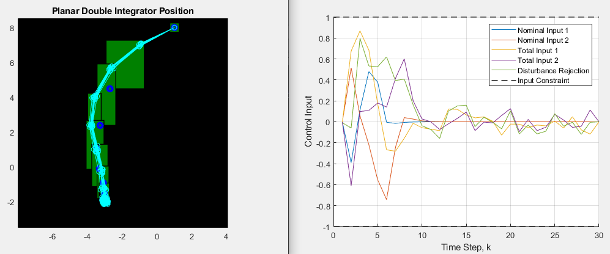

# Robust Dynamic Tube MPC

This repo contains uncertain discrete time linear models and examples of applying time-varying tube-based model predictive control (MPC).  

**Dependenices**: 
- [MATLAB controls toolbox](https://www.mathworks.com/products/control.html)
- [YALMIP](https://yalmip.github.io/tutorial/installation/)
- [MOSEK](https://www.mosek.com/products/academic-licenses/)
- [MPT3](https://www.mpt3.org/)



## Setup
```
>> startup
```

## Elastic Tube Optimal Control Example 
1. Edit initial state and elasticity weighting in example file
2. Set `useDataFile` to false to recompute tube approximation parameters if you want to see all the action 

```
>> run_planar_double_integrator
```

## Tube-to-Tube RRT Motion Planning Example 
1. Edit maximum iterations, initial/final nominal states, and ETOC solver tube length(s) in `rrtstar_etoc.m`
2. Create additional obstacles using polytopes in `build_map.m`

```
>> rrtstar_etoc
```

## TODO
### March 2022
- [x] Speed up preprocessing
- [x] Add support for homothetic and fixed size tubes
- [x] Add different boundary condition options
    - [x] Set-based initial and final conditions
    - [x] Support mixed set and state boundary conditions
- [x] Verify objective function for non-zero goal state
- [ ] Add tube trimming 
- [x] Update stale models
    - [x] `double_integrator_model.m`
    - [x] `spring_mass_damper_model.m`
- [x] Add full state vs. time plotting to all postprocessing scripts
- [x] Decide on node and edge data for tube-to-tube RRT* tree
- [x] Add RRT planner

### April 2022
- [ ] Add tube-to-tube ETOC steering to RRT planner
    - [x] Add tube obstacle collision check
    - [x] Decide on constant or decreasing prediction horizon
    - [ ] Add tube interpolation / overapproximation / convex hull?
- [ ] Decide on rewiring strategy for RRT* planner
- [ ] Full example using basic map and `planar_double_integrator_model.m`
- [ ] Predicition horizon performance study
- [ ] RRT* radius performance study
- [ ] Add vehicle model
- [ ] Add additional map options to `build_map.m`
    - [ ] Map saving
    - [ ] Non-convex obstacles


## References
### ETMPC
```
@INPROCEEDINGS{7525471,
author={Raković, Sas̆a V. and Levine, William S. and Açikmese, Behçet}, 
booktitle={2016 American Control Conference (ACC)},   
title={Elastic tube model predictive control},   
year={2016},  
volume={},  
number={},  
pages={3594-3599},  
doi={10.1109/ACC.2016.7525471}}
```

### HTMPC
```
@INPROCEEDINGS{6561023,
author={Raković, Saša V. and Cheng, Qifeng},
booktitle={2013 25th Chinese Control and Decision Conference (CCDC)},
title={Homothetic tube MPC for constrained linear difference inclusions},
year={2013},
volume={},
number={},
pages={754-761},
doi={10.1109/CCDC.2013.6561023}}
```